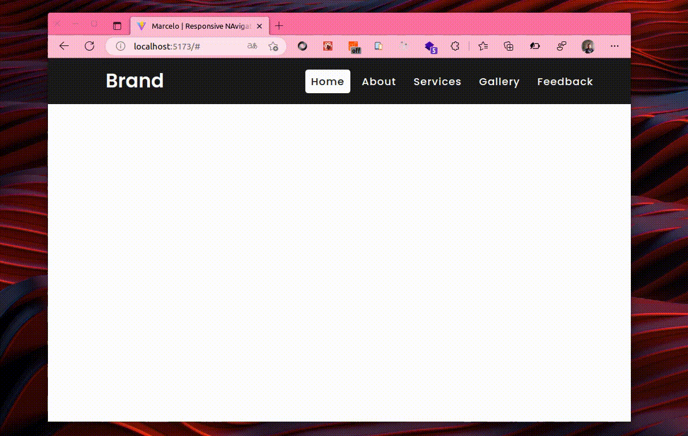

# Responsive Navigarion Menu

Aplicação simples de menu responsivo em react usando vitejs com styled-components e fontawesome icons.

#### tecnologias:

- styled-components
- react-fontawesome
- fontawesome-svg-core
- free-solid-svg-icons
- free-regular-svg-icons

---

## Screenshot

---
